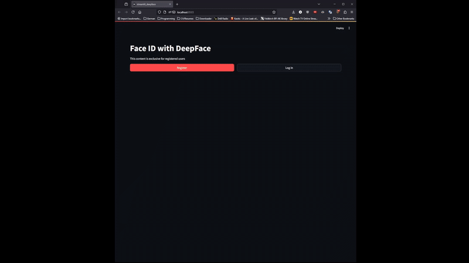

# Face recognition for ID Login

## Introduction
This notebook is a simple implementation of face recognition for ID login. The idea is to use the face recognition model to identify the user and login to a website using Streamlit. The website will then display the user's name and show the private content. 

The project uses different models for face recognition.
## Goal
The goal of this project is to learn how to use face recognition models and integrate them into a website using Streamlit. 

Different models are used for face recognition: finetuned model from VGG16, SVM and DeepFace.

Each model is evaluated based on the accuracy of the predictions.

The models have different implementations so the accuracy and its calculations are different.

### Instructions
1. Run the notebook `face_recognition.ipynb`to train the models.
2. Run the Streamlit apps to test the models:
 	- `streamlit run streamlit_own_model.py`
	- `streamlit run streamlit_deepface.py`
	- `streamlit run streamlit_svm.py`

The app and Interface is the same, just the underlying model for the login is different.

After successful login (provided pictures named `actor1.jpg` etc.), the website will display the user's name and show the private content.

The private content is the same for all users. In this case is the **jupyter notebook**.
## Motivation
Face recognition is a popular topic in computer vision. It is used in many applications like security, surveillance, and biometrics. This project is a simple implementation of face recognition for ID login. The goal is to learn how to use face recognition models and integrate them into a website using Streamlit.

### Training from scratch
Training from scratch did not work well. The model was not able to learn the features of the faces. The accuracy was very low. After several iterations and tweakings went up from ~0.1 to ~0.3, but still not good enough.

That is why the decision to use pre-trained models and fine-tune them was made.

As MIT computer science professor David J. Malan says:  
> We do not have to reinvent the wheel,
> 
> The problems that we are facing have been faced by others before us, 
> 
> and they have already been solved by more experienced developers.

The availability of libraries that provide pre-trained models makes it easier to implement face recognition. The models can be fine-tuned or used as they are. Some of the popular libraries also include useful functions that make it easier to implement face recognition.

### Change in Direction
The primary goal was to implement a live face recognition system using a webcam. However, due to the limitations of the Streamlit app and problems with the webcam and the libraries used (cv2), the project was changed to a simpler version where the user has to take a picture with the webcam or upload a picture to login.

CV2 did not work in any of my devices to open a webcam. The error was related to the backend of the cv2 library. The error was not solved after several attempts.

Streamlit does not support natively the capture of video from the webcam, only to take pictures as a image input. The only way to do it is to use the cv2 library, which did not work.

### Streamlit
Streamlit is a popular library for creating web applications with Python. It is easy to use and has a simple syntax. 

The problem with streamlit is that is limited on the components that can be used. For example, it does not support the capture of video from the webcam.

Also, a streamlit app can become very messy if it has too many components as it mixes the python code for the logic and the htm/markdown code for the interface.

The final idea was to have a single streamlit file that could be used for all the models. The only thing that changes is the model used for the login. In this idea, the login popup would have 3 buttons, one for each model. The user would choose the model and then take a picture to login.

For several issues and errors, the final implementation contains 3 different streamlit files, one for each model.

## Dataset
The dataset used in this project is the [Celebrity Face Image Dataset (Kaggle)](https://www.kaggle.com/datasets/vishesh1412/celebrity-face-image-dataset/data). The dataset contains images of 17 celebrities, each with 100 images and in independent folders named after the celebrity.

Additionally, a 18th folder named as the student's name contains images of the student. This images are obtained from a 13-second video of the student's face, looking at the camera and then rotating the head to the left, right, up, and down.

For data privacy reasons, the student's files are not included in the repository.